# BETTER WEB TYPOGRAPHY FOR A BETTER WEB
Better Web Type is an easy-to-follow web typography email course for web designers & web developers.
Created by [Matej Latin](https://betterwebtype.com/)

## Lessons
1. [Introduction to typography](#1-introduction-to-typography)
2. [Equilateral triangle of a perfect paragraph](#2-equilateral-triangle-of-a-perfect-paragraph)
3. [Anatomy of a typeface](#3-anatomy-of-a-typeface)
4. [Choosing Typefaces](#4-choosing-typefaces)
5. [Combining Typefaces](#5-combining-typefaces)
6. [Rhythm in web typography](#6-rhythm-in-web-typography)
7. [Modular scale & meaningful typography](#7-modular-scale--meaningful-typography)

## 1. Introduction to typography
“Perfect typography is more science than an art” is a famous quote attributed to Jan Tschichold—the man that published his revolutionary book The New Typography in 1927. He, among other typographers from that era, had a profound impact in the field of typography. >?

“Typography is more art than engineering—though engineering is certainly a part of it” is what Robert Bringhurst, author of The Elements of Typographic Style (recognised as the typography bible), believes in. 

It might seem strange at first, that such influential men in typography could have such contradicting opinions when it comes to defining it. Tschichold believed it was more science, Bringhurst sees it more as an art. Both placed it on the line connecting the two but they placed it on the opposite ends.

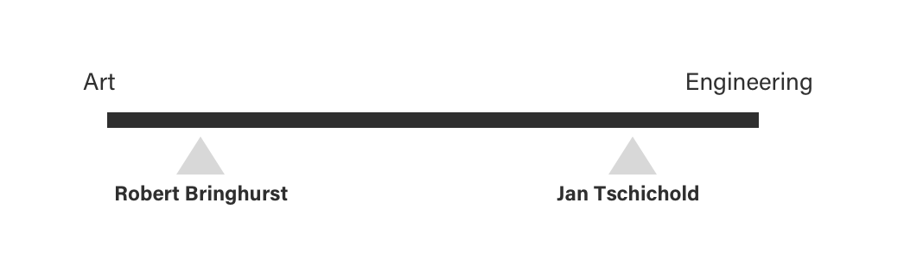

Tschichold was a part of the revolution in graphic design in the early 1920s. It was the time of industrialization. A time when the engineer was seen as the savior of the world. Engineering was in front and center of whatever was produced. Type setting as a process was being swept into this new industrialized world. Whatever tools graphic designers used at that time, they needed engineering skills. This probably shaped Tschichold’s opinion when it came to defining typography.

Bringhurst already witnessed the magic of digital design. There’s no more physical parts that need to be assembled in the type setting process. The age of information made that process a matter of seconds instead of hours. Designers only need the right software and a right printer these days. Both are tools they don’t produce themselves. So there’s very little, or no engineering in a modern print design process. Bringhurst focused on the print typography in his book which is what may sway his definition of typography more on the side of art.

### Web developers should have typography skills too
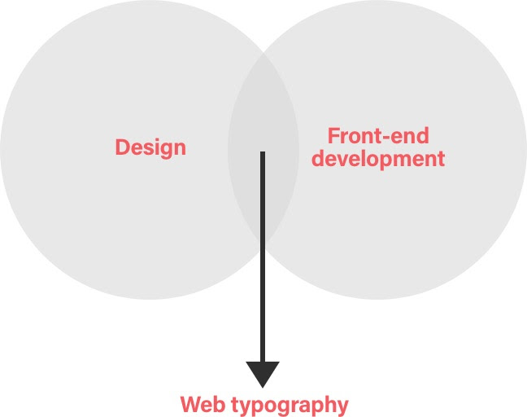

I believe that when it comes to the web, typography lies right in the middle. That’s why I think both designers and developers need to learn the basics of typography. It is expected from designers to have these skills. It’s expected that they know how to type set and when to choose what typeface. How to shape a paragraph and how to use a scale. How to use grids to establish rhythm in their work. I’ve worked with many designers so far and found that’s rarely the case. Either the designers are self-taught and haven’t learned about the importance of typography yet or they studied graphic design and saw it just as a class they had to attend. Developers, don’t expect your designers to be proficient in typography. 

Whatever gets designed for the web needs to be transformed into code. There is no printer. No magic button that transforms designs into code. Not in a way that could actually get used. People that can do both parts well, design and code, are rare. It takes a lot of time and dedication to really master both sets of skills. This means that even the designers who have good typography skills usually don’t have the skills to transform their work into what really counts—code. So it falls on web developers to cover a large part of this grey area. Web developers who aren’t expected to have any of those skills. Web developers that try their best to transform those designs into code, but fail to see small details that make a difference. It’s time we recognize the importance of their role in shaping web typography. It’s time we stop excluding them from the design process. The design process isn’t something designers should own themselves, it’s something where other people can take part and make their own contributions. Don’t simply follow what is drawn by a designer—an approximation of what the website should look like. Understand why it’s done so. Correct your designer when it doesn’t make sense. Work on web typography. Work on typographic details with your designer. Work together. It’s your job to produce a typographic style that works—as a team.

That’s where Better Web Type comes in. And that’s why it’s designed for both web designers and web developers. Its goal is to put web typography right in the middle between art (design) and engineering (development). To cover most of that grey area and invite web developers in the design process. To educate the people that are involved (or the ones that should be) in a web design process to do a better job when it comes to web typography. To start producing a better web typography in order to be able to contribute to a better web. A web that is readable. A web that doesn’t scream at the reader. A web that informs.

### Why is typography important
Jan Tschichold and Robert Bringhurst may not agree on how to define typography, but they certainly agreed on what its goal is. They just used different words to describe it. “The essence of new typography is clarity” is set in bold in Jan Tschichold’s book. “The new typography is distinguished from the old by the fact that its first objective is to develop its visible form out of the functions of the text… form must be created out of function” Tschichold elaborates. 

Bringhurst was more concrete. Typography must invite the reader into text, reveal the tenor and meaning of the text, clarify its structure and order and link the text with other existing elements. 

> Most people think typography is about fonts. Most designers think typography is about fonts.
> Typography is more than that, it’s expressing language through type. Placement, composition, type choice.

—Mark Boulton

Typography is not about fonts alone. It’s not about type size, margins, spacing, scales or colour. Typography is about organizing information in an objective way. It’s about information and how we transfer this information to the reader. Size, colours and fonts are just tools that help us put this information into the right shape. And as we will see, all these tools must work together as a whole. None is independent of the others. Web designers and web developers alike need to take a step back from merely choosing fonts and take a look at the bigger picture that typography actually is.

### Font or typeface?
Let’s clarify this before we continue. Using the word “font” in a company of typographers will earn you a few odd looks. Some of them might even get on the offensive and won’t hesitate to call you a newbie or even an ignorant. “Font” is for a typeface like “mp3” is for a song. And I have never heard anyone say “I really like that mp3”!

I tend to use both words. It simply depends on who I talk to. “Typeface” might be unclear to people who aren’t into typography so I’ll use “font” in that case. But in this course I’ll use the words according to their actual meaning. A “font” will mean “helvetica.ttf” and a typeface will mean “Helvetica” (a family of different weights and styles).

### Explore further
* [@##Web design is 95% typography](https://ia.net/topics/the-web-is-all-about-typography-period/)
* [Font vs Typeface](http://studiobuchanan.co.uk/talkingtype/fontvstypeface)
* [Jan Tschichold](http://www.designishistory.com/1920/jan-tschichold/)
* [Book: The Elements of Typographic Style by Robert Bringhurst](https://www.goodreads.com/book/show/44735.The_Elements_of_Typographic_Style?ac=1&from_search=true)

## 2 Equilateral triangle of a perfect paragraph

> The reader should be able to read the message of a text easily and comfortably. This depends to a not inconsiderable extent on the size > of the type, the length of the lines and the leading (line-height).

—Josef Mueller-Brockmann

We don’t read letter per letter. We only do that when we’re children and are still learning to read. After that we read word by word. The words that we’ve become familiar with are stored in our brains. So reading is basically recognising shapes of words. Our eyes constantly move left and right in the process of reading. They do that so quickly that we don’t even notice. These eye movements are called saccades. They’re broken up by fixations which usually come at the end of words. After each line of text our eyes get a longer break as we switch focus to the next line in the text. Make these lines too long and the eyes will get tired quicker. Make the spacing between the lines too tight and our eyes will get confused on which line to start reading.

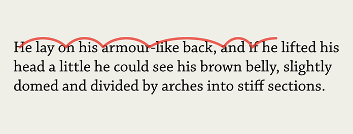
Figure 3: Saccades, eye movements, illustrated (Source: A List Apart).

Typography can improve a text’s readability by following the basic general principles that have been developed since the first printing machine back in the 15th century. These general principles are adapted to the way we read.

A well designed and type set text is easier to read because it takes these considerations into account. This is why type size (and colour), measure (line width) and leading (line-height) are so important. With these we literally shape the reading experience. There’s typographers that do this for books and graphic designers that do it for magazines and other printed media. On the web, this task falls somewhere between the web designer and web developer. In rare cases, this would be the same person.

### Type size & colour
One of the mistakes that most web sites make is that they make the main body text too small. Back in early 2000s it was common practice to set the body text to a size of around 11px. But back then the screens were smaller with lower screen resolutions. 11px back then was larger than it is now.

A common rule for setting the body text is to set it to a size that would match the size of the text in a book at an arm’s length distance.

Figure 4: Matching the font size with the text size from a book at an arm’s length. (Source: iA)
 
Recommended size for today’s screens is 16px for mobile and from 18 to 22 px for desktop. This also depends on the typeface. As we’ll see later in the course, some typefaces set at 16px may seem larger than others.

“Type colour” in typography doesn’t mean actual colour like red, blue or green. Type colour means how heavy black type on a light background looks like. A typeface of the same size and same weight may seem heavier than another one.  

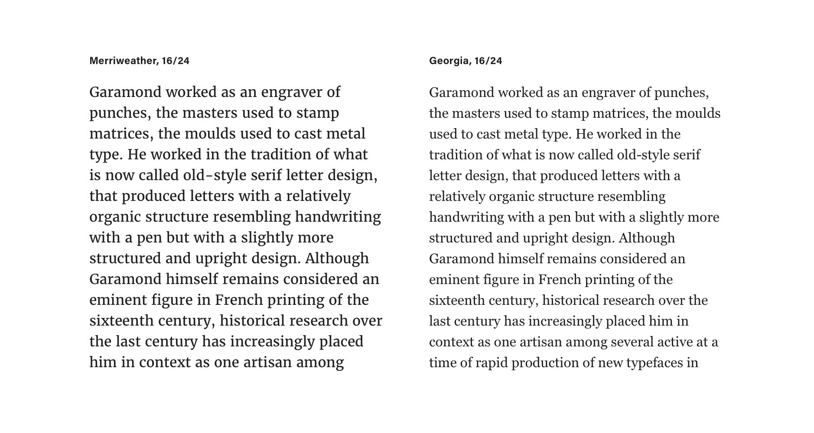
Figure 5: The same text set in Merriweather seems larger and heavier than when set in Georgia.

### Line width (measure)

Reading very long lines of text is tiring for our eyes. Our eyes need constant pauses which are provided by line breaks. In that instance of switching to the next line, our eyes get that short pause. Short, but long enough to keep them going for longer. It’s like an engine that doesn’t run on full all the time so it keeps going longer without overheating.

The ideal width of a line of text is from 45 to 75 characters—including spaces. Anything that reaches far from that range gets hard to read very quickly. Too much line switching when lines are too short and to few breaks for the eyes when they’re too long.

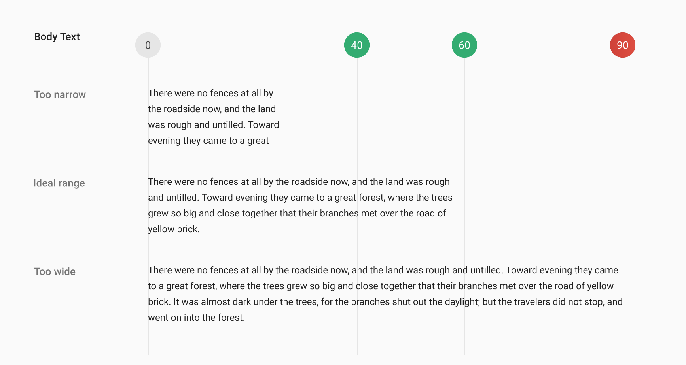
Figure 6: Recommended line width in Google’s Material Design Guidelines (Source: material.io)

### Line-height (leading)

Line-height, or leading as it’s usually referred to in print, is the main pillar of rhythm in typography. We’ll cover that later in the course, in the lesson 6—Rhythm in web typography. For now, let’s take a look at what affects the line-height.

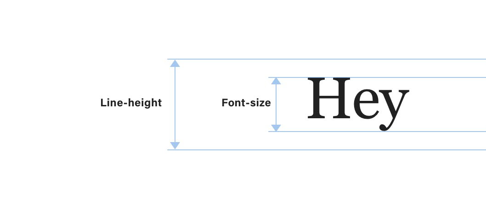
Figure 7: Line-height (leading) works different on the web. It’s evenly distributed below and above the line of text.
 
Too many designers or web developers that I’ve met think of line-height as an isolated text feature. So they tend to set it based on what seems right. Consequently, line-height is something that gets set without too much consideration. But line-height is too important to be set so mindlessly. The width of the lines affects the line-height. The longer the lines, the more space between them is required. Type size affects the line-height. The larger the type, the larger the line-height should be as well. Type colour affects it too. Darker and heavier type requires more space between the lines. And in the end, the typeface itself may affect it as well. We’ll cover these later in the course but I already mentioned that some typeface may seem larger than others. Some, mostly serifed typefaces, will seem heavier. Those will require more space between the lines too.

Now that you know that line-height is very important and that it should never be considered as an isolated feature, let’s look at general best practices. For paragraphs, ideal line-height is usually between 1,3 and 1,6. So a body text set at 16px should have a line-height from 21 to 26 px. This will depend on the things mentioned earlier: typeface design, type size, weight etc.

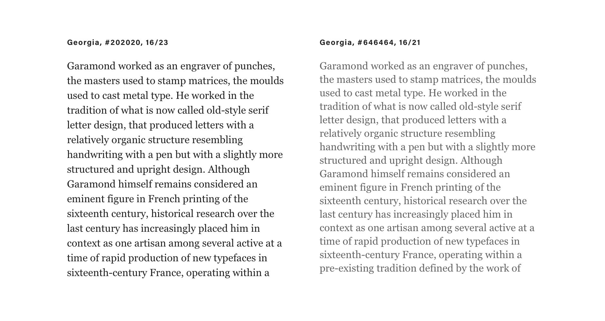
Figure 8: Same typeface, same font size, different colour. Darker text should have larger line-height.

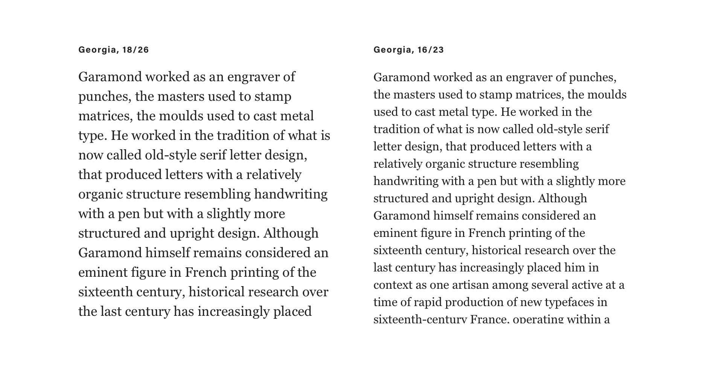
Figure 9: Same typeface, same colour, different font size. Larger text should have larger line-height.

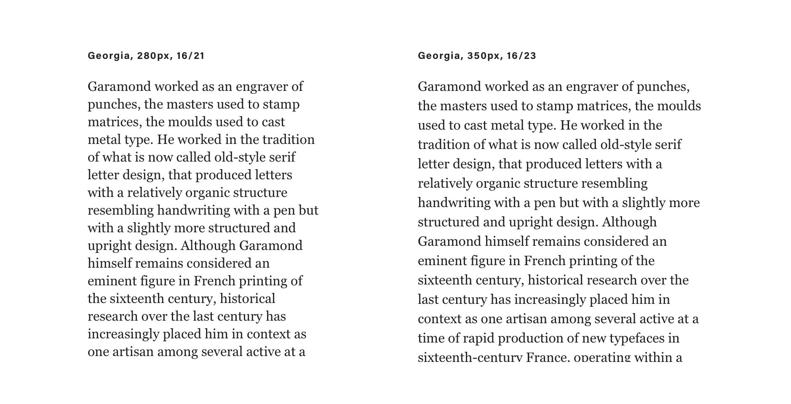
Figure 10: Same typeface, same font size, same colour, different line width (measure). The longer the line of text, the larger the line-height required.
 
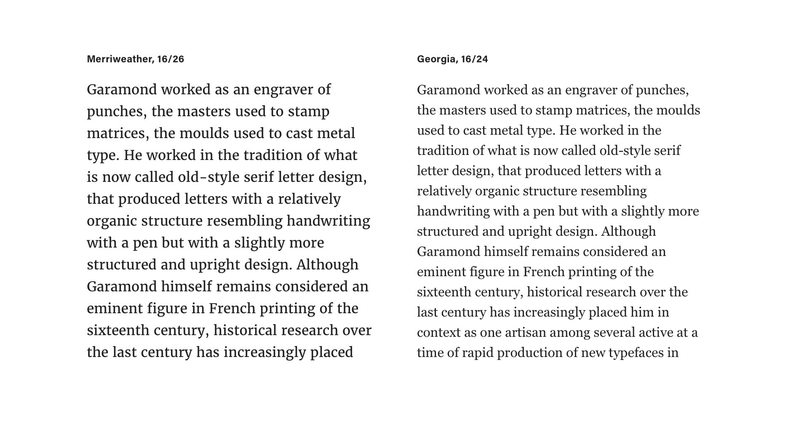

Headings are usually much shorter so they need to have less space between the lines so they don’t look like they’re drifting apart. Recommended line-height for headings is from 1 to 1,2 so a heading set at 24 px will need a line-height from 24 to 29 px. This may seem a bit ridiculous at first but try it. Once you see the difference you can’t unsee it.

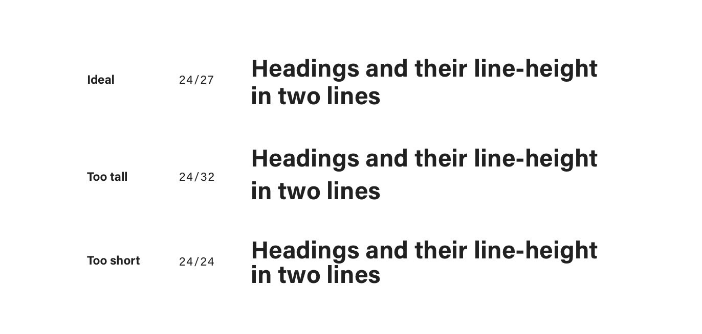
Figure 12: Headings (especially larger ones) need a smaller line-height than body text.

Note that in languages that use capital letters more than others (German for example), it’s recommended to use a larger line-height.

### The equilateral triangle
There are some general best practices in typography but they’re never definite. As we saw with the line-height, we’re commonly presented with ranges that we should use. What to choose from that range takes time to learn. The eye needs time to get sharper in noticing these differences. That’s why it may seem wrong at first when you set your heading to a smaller line-height than the paragraphs, but in time you’ll see that it’s actually correct.
 
And so we come to what I call the Equilateral triangle of a perfect paragraph. We’ve looked at type size, measure and line-height in isolation (as much as we could). By doing so, we already learned that these features are interconnected. They can’t be considered in isolation and they never should be. That’s why an equilateral triangle is a perfect representation of a well designed paragraph of text. For it, we need a good type size that matches the measure, which matches the line height. Get one of them wrong and your triangle will get skewed.

Unfortunately I can’t give you definite numbers of a perfect paragraph as there are millions of combinations out there. But I can give you a few examples that will help you train your eye. Try to pay attention to the details and compare the type size, the lengths of the lines and the spacing between them.

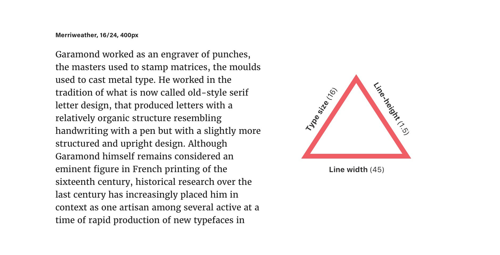
Figure 13: A perfectly balanced paragraph represented by an equilateral triangle.

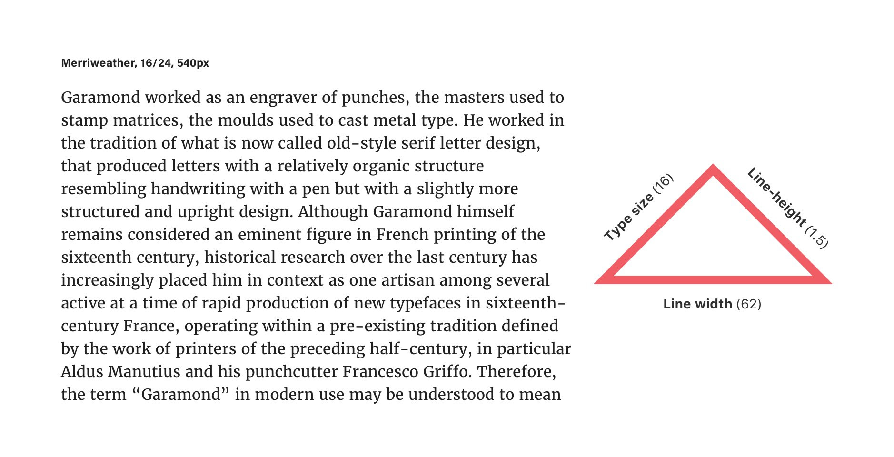

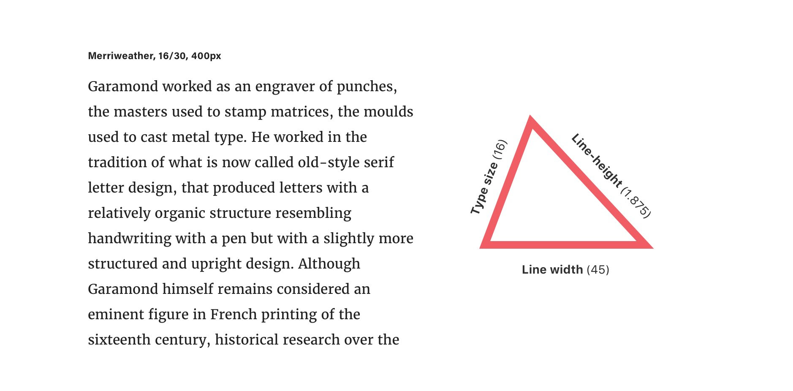

### Explore further
* [How we read](https://alistapart.com/article/how-we-read)
* [45 to 75 — Character counter to optimize line length](https://chrome.google.com/webstore/detail/45to75/efmppndinjbljeellfdkpghgblenbcdd/)
* [Readability: the optimal line length](https://baymard.com/blog/line-length-readability)

## 3 Anatomy of a typeface

Typefaces come in all shapes and forms. Serif and sans-serif are the two main groups but each consists of numerous styles. Old style, transitional, neoclassical, slab, clarendon and glyphic for serifed typefaces; grotesque, square, humanistic and geometric for the sans serifs. Exploring these reminds me of space exploration. A vast amount of typefaces, each different from the other, each unique, each special. Just like stars and planets, despite their uniqueness, all typefaces have something in common—their anatomy. No matter how special or unique their style is, all typefaces share most of their main features. Looking at typefaces is just like gazing at the night sky and looking at the stars. Nothing special if you don’t know what you’re looking at but very interesting if you know where to look and recognizing unique features that define the typefaces (or stars).

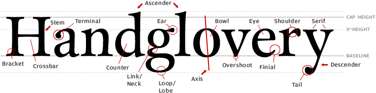
Figure 17: Anatomy of a typeface

Let’s look at a few main features that will help you gaze the sky a bit better. We don’t need to know all the details so we’ll cover the most basic features. Ascenders and descenders are the most noticeable. They define the shapes of letters and they define the letters themselves. Ascenders are the parts of letters that lie beyond the x-height line and the descenders are the parts that lie below the baseline. Cap height marks the most upper part of the capital letters. Notice that the ascenders go beyond that line. Also notice how some letters go slightly beyond the baseline and the x-height line. Take a look at the “o” and “e” in the figure x. Type designers do that to make the letters optically balanced. A more rounded letter needs to be a bit larger to seem balanced with the other larger and less round letters.

### Type colour & weight
I mentioned type colour in the previous lesson already. If you remember, I wrote that in typography  by type colour we don’t mean actual colour. We mean how heavy a black typeface looks like on a white background. Let’s do a quick test. We have two typefaces: Merriweather and Georgia. Both are beautiful serifed typefaces. Let’s set them to a size of 16px, apply a dark grey colour and put them on a white background. Let’s put them side by side so we can compare them easily.

Figure 18: Paragraphs set in Merriweather and Georgia side-by-side.

Spend a few moments observing the typefaces and the features we just went through. If you spend enough time doing this, you’ll notice the main difference between the two. Merriweather looks heavier. It looks darker. It even looks larger—we’ll come to that soon, let’s focus on the colour and weight for now. Now let’s take a step backwards and look at longer paragraphs. Both are set in regular weight, at the same size and with the same line-height. Yet, they look very different. Georgia has a higher contrast than Merriweather which makes it look lighter. This, combined with other features (height and size of letters) give Georgia less presence on the page. That’s what we mean when we say “type colour” in typography.

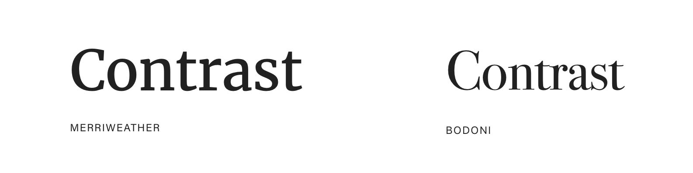

### X-height
We noticed the difference in size of type in the last example. Even though both paragraphs are set at the same size (18px), the two typefaces look very different. Let’s take a closer look.

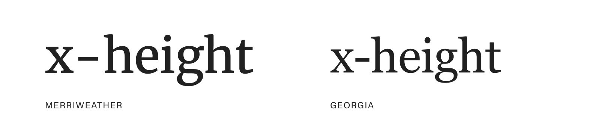

Let’s compare the attributes of both typefaces. Spend a few minutes observing and comparing them. Done? Ok, let’s see. Let’s draw the lines: the baseline, the x-height line, the cap-height line and the line where descenders end. Let’s do that for Merriweather only as it will be easier to spot the differences.

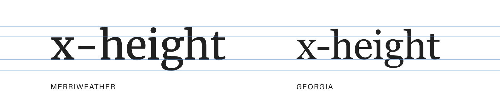

The baseline lies right at the bottom edge of the lowercase x and the x-height line right at the top edge of it, hence the name x-height. I drew the lines long enough so they go all the way to the side where the word set in Georgia lies. Have you noticed the difference yet? The letters of the same word, set at the same size but set in Georgia don’t touch the x-height line coming from the same word set in Merriweather. The x-height of Georgia is therefore shorter than the one of Merriweather. Take a look at the cap-height line and you’ll notice the same. The height of letters in Georgia, both upper and lowercase, are shorter than the same letters in Merriweather. That’s what makes Merriweather seem taller than Georgia.

We set type sizes on the web by specific dimensions. Whether in pixels, EMs or REMs—we always end up with type set in particular size set in pixels. But these pixels don’t mean a lot in typography. It all depends on the x-height of a typeface.

Typefaces with a taller x-height are considered modern and easier to read. Merriweather, Roboto Slab and Freight Text are great examples of modern serifed typefaces with a large x-height.

Typefaces with a smaller x-height are considered less modern and classical. Great examples include typefaces like Garamond, Baskerville and Bodoni.

We’ll come back to x-height in the lesson about combining typefaces so keep it in mind.

### Explore further
* [Type Classifications](https://www.fonts.com/content/learning/fontology/level-1/type-anatomy/type-classifications)
* [Anatomy of a typeface](http://typedia.com/learn/only/anatomy-of-a-typeface/)

## 4 Choosing typefaces
> In the new computer age the proliferation of typefaces and type manipulations represents a new level of visual pollution threatening our > culture. Out of thousands of typefaces, all we need are a few basic ones, and trash the rest.
—Massimo Vignelli

One of the greatest visual communicators, Massimo Vignelli, made a career by only using 6 typefaces. And he produced a lot of graphic design work in his life. For him, all the many typefaces presented noise and pollution. He saw them as distractions—meaningless trends that come and go. His view was quite radical but I think he had a point. There’s so many typefaces out there that it’s hard to know how to separate the good from the bad. And believe me, there’s more of the latter than the former.

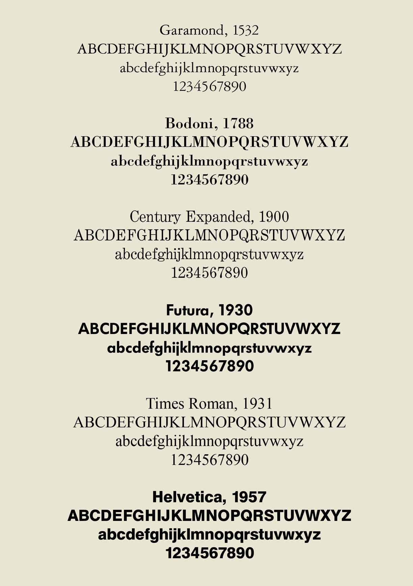
Figure 23: Massimo Vignelli’s 6 typefaces (Source: Fontsinuse.com).

Choosing a typeface for a website is more often than not a mindless decision based on personal preferences. What looks good to the designer is sadly more important than what the readers expect. There’s no connection with the content and so no real relationship with the person reading either. Typography must invite the reader into text. I quoted Robert Bringhurst in the first lesson already. I’m quoting him again because I think this is the most important goal of typography.

It’s not about how many typefaces we have to choose from. Or how many times we used a particular one. It’s not about its popularity and it’s not about the trends either. Choosing typefaces based on trends will only assure our websites fading into faceless artefacts without identity. The question is not really which typeface to use, it’s what will you do with that typeface.

Typography has many definitions. Depending on whom you ask, each will tell you a slightly different idea of what typography is and what defines it. But none of the best minds in the typography field ever said that typography is about choosing typefaces alone. Typefaces are merely tools. With them, we give a shape to the information we want the reader to consume. So the question isn’t what typeface should we use. The right question is what typeface should we use to best match the content. Therefore, typefaces, or even typography, and information (content) are inseparable. One does not exist without the other.

### Web-safe fonts don’t suck
Times when we had just a few of typefaces to choose from are far behind us. I remember how I’d always check what fonts are web-safe when I first started doing professional web design work. There weren’t many to choose from but I still forgot most of them. Most of the times, I just wanted to get rid of that default look of a website that came with Times New Roman. Soon I started to connect it to whenever something didn’t work or I messed up something in CSS. That negative connotation with it stopped me from realizing that Times New Roman is a nice typeface. I don’t think I ever used it at all.

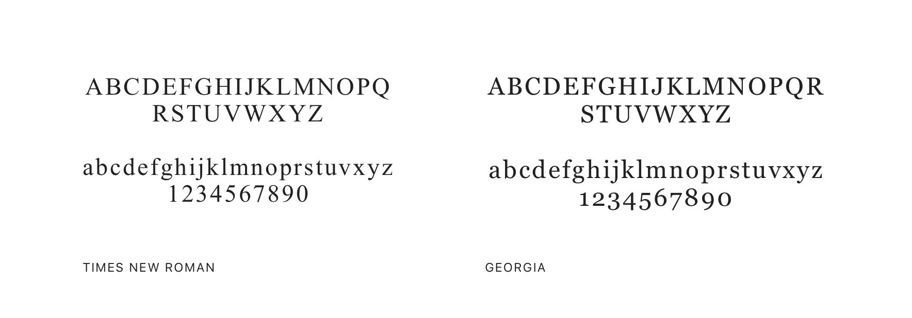
Figure 24: Two beautiful typefaces that don’t cost a thing (zero dollars, zero kilobytes).

But think about it. Times New Roman and Georgia. Both are very nice serifed typefaces that don’t affect your website's loading time. Georgia was specifically designed for digital use. It was meant to be used on screens. It looks a bit narrower and taller than Times New Roman. A bit more modern. Have you ever used any of these typefaces? Why not? Why not give them a try now?

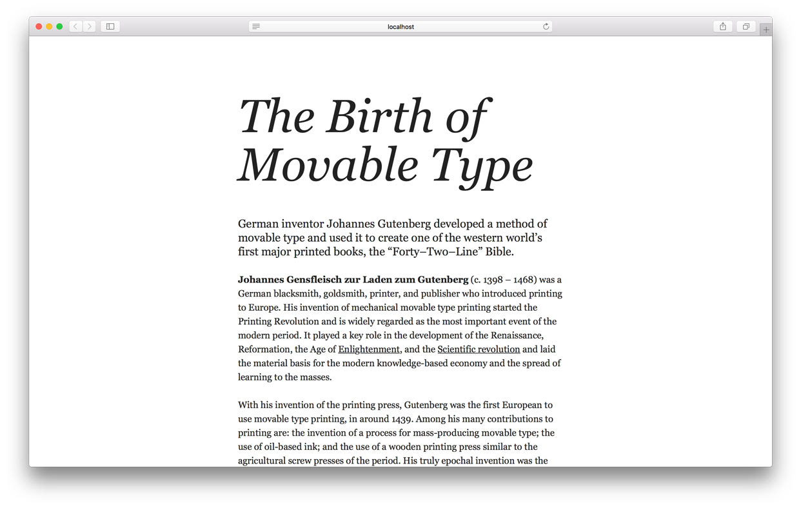
Figure 25: A website set in Georgia only.

Web safe fonts should remain an option. Especially when it comes to large scale websites that need to work on various devices—not just the fancy iPhones or MacBooks. What about the devices with a poor connection to the internet? 200 kb of a fancy font might be the difference between a returning visitor and a bounce.

### Web fonts and FOUT
There’s another problem when it comes to loading custom web fonts. The so called “flash of unstyled text” or FOUT. It’s that second or two when the content of the website is loaded already but the custom web font isn’t yet. It’s a second or two and a desktop with broadband connection but it may be a few second or more on a mobile with 3G. Keep this in mind.

What is the problem with FOUT? I think most people just hated seeing the shifting between the fonts on their website. [It does look a bit strange](http://martinwolf.org/wp-content/uploads/2014/12/fout.gif). So people started to solve this by hiding the text until the font loaded—FOIT (flash of invisible text). I used to do this too, but there’s a problem with that. Let’s say that the font that you want to use doesn’t load for some reason. Your website is waiting for it to load and has hidden the text in its anticipation. The font doesn’t ever load and the text stays invisible. That sucks. There’s people who set a timer on the waiting and load the web safe font after x seconds. That’s just a nasty solution. My suggestion is just let it be. Stick with the FOUT, just try to match the web-safe and your custom fonts to minimize the difference. There are other solutions in the further reading section if you want to dive in.

### Things to consider when choosing typefaces
I tried sorting these by assigning a priority to each but it was really hard to do. I think these considerations should be taken into account almost equally but still managed to sort by some sort of priority.

### Goals
What is the goal of your text? Or even, of your website? Is it a place where people come to read medium to long articles? Or is it a website where most people are expected to scan the content, looking for something particular?

### The text
This is the most important step everyone skips or even completely ignores. So many web designers design pretty pictures of web sites in their perfect shapes. Most of them still use Lorem Ipsum as dummy text. Find out what the website is about instead. What type of content will be published? News? Blog posts? Poems? Essays? Get some content samples. This is important. How will your typeface choice complement the content and the information on the website if you don’t read it? At this point you probably thinking: “read it??” Yes, read it. “But I don’t have time, I have pages to design, lines of code to write. I have deadlines to hit.” Excuses. You’ll never get better in choosing typefaces if you ignore the content. What is the author trying to convey? Don’t design without content. Don’t use dummy text. At worst, use similar content—find something similar online.

### Typeface
What are you after? What is the content of the website? What typeface would complement that content in a most objective way? What are the people that will read this used to? What do they expect? Will a modern geometric sans-serif seem off? Should we go for a modern serif instead?

### Body text or headings?
Are you choosing a typeface for body text or will it be for titles only? Will the two be different? Will one work well with the other? (We’ll cover the topic of combining typefaces in the next lesson). This is an important question that needs to be addressed early in the process. If the typeface is for body text, you should pay particular attention to the readability of longer texts set in it.

### Weights and styles
Does the typeface come with the basic weights and styles? Bold, italic and bold italic? Are there more weights? Some typefaces have numerous weights and styles and are commonly being referred to as workhorse typefaces. Even if they do, use only a few weights. Two or three should suffice.  Some may only come in one weight or style. I recommend avoiding these. They’ll limit you too much.

### Fonts size in Kb
This depends on all considerations mentioned so far. Some typefaces will be heavier than others. Serifs are generally heavier in Kb than the sans-serifs. Some bold styles are bolder than others which, again, affects the size in Kb. So does how many weights you want to use. I tend to avoid using the bold italic so I can usually save a few Kbs by excluding those.

### Opentype features & language support
I consider the Opentype features a bonus. If there are two typefaces that I’m considering and one supports the Opentype features and the other doesn’t, I’ll go for the one that does. Not all typefaces support these features and even the ones that do, don’t always support all of them. We’ll get to Opentype features in the later stages of this course.

What language will the website be in? English only? Multiple languages? The Latin language range should suffice for most western languages but here’s a trick. If your website is a single-language only, you can save a few kilobytes by excluding all other. My websites have been English only for a while now so I always choose that set of characters alone. Sometimes it can save up to 20 kilobytes. If the language that your website is in requires special characters, make sure that the font you want to use has those.

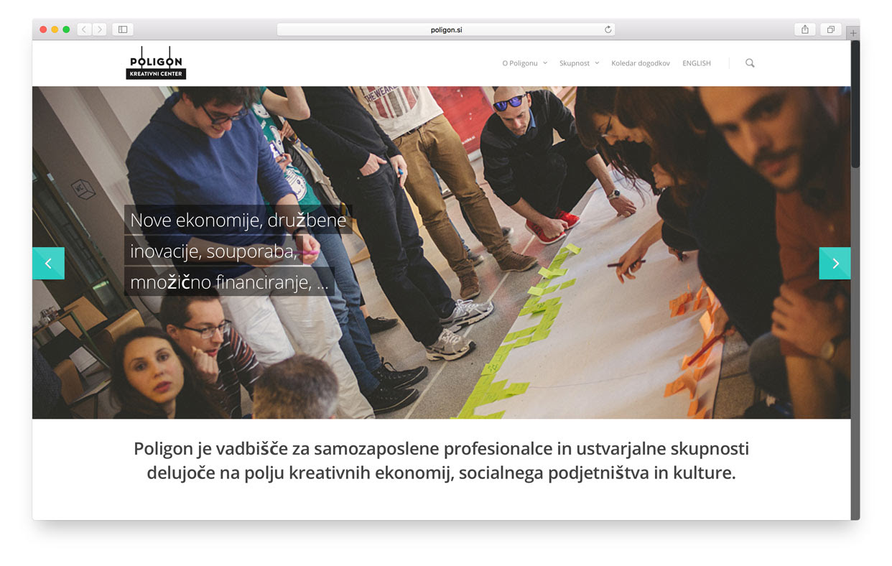
Figure 26: Poligon.si uses a font without the required characters č, š and ž.

### Reviewing typefaces
Don’t look at typefaces in Photoshop, Sketch or some other graphic design tool. Your content will not appear there. It will be displayed as part of a website in a web browser. Multiple web browsers actually. Try your main typeface in different sizes, colours and different browsers. Each has a different way of rendering fonts (Firefox is known to render all fonts a bit heavier than others). Try it on different OS systems as well. Don’t just design a fancy looking visual design of a website on your MacBook Retina and make decisions based on that. Try what it looks like on Windows and on other screens.

Note: if you don’t know how to set your text in HTML and apply CSS to it, you should preview the typefaces on the font provider's’ website. In the worst case use the Font Changer plugin below. Find a website with decent typography (I recommend Web Font Specimen) and change the font to the one you want to use.

### Task
Now that you learned about the anatomy of typefaces and the considerations of choosing them, it's time to explore the web. Install the [What Font](https://chrome.google.com/webstore/detail/whatfont/jabopobgcpjmedljpbcaablpmlmfcogm?hl=en) or [Fontface Ninja]() plugin. Whenever you stumble upon a typeface on a website that you like, look it up. Check what font the website is using, what’s the size, the line-height and the weight/style. 

### Explore further
1. [Font Changer with Google Fonts](https://chrome.google.com/webstore/detail/font-changer-with-google/jgjhhoglgjdklldfgoffdiaceffijeke?hl=en)
2. [Web Font Specimen](http://webfontspecimen.com/)
4. [Massimo Vignelli’s 6 typefaces](https://fontsinuse.com/uses/14164/massimo-vignelli-s-a-few-basic-typefaces)
4. [FOUT, FOIT, FOFT](https://css-tricks.com/fout-foit-foft/)
5. [Times New Roman](https://www.youtube.com/watch?v=-cGUaBbT0bA)

## 5 Combining Typefaces
Bad typography on the web in the early years of the internet was often blamed on the poor range of typefaces available. But we already learned that typography is not about choosing typefaces. It’s about presenting information in a way that is readable. So the question that we need to answer is: do we really need more than one typeface?
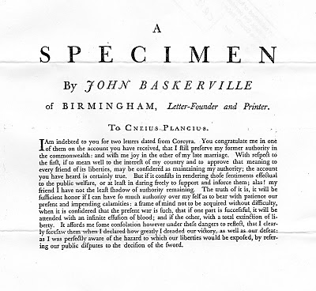
Figure 27: Typographic work in a single typeface—Baskerville.

> It is a safe rule not to mix different styles of letters on the same page, or different faces of type in the same book.

—Eric Gill

Combining typefaces is probably one of the trickiest parts in typography. There’s no definite rules to follow. Which makes it even harder. There are guidelines and best practices but you’ll need to spend more time exploring typefaces and trying out different combinations. I like to believe that in typography, if it’s done well, anything goes. As it is with most things in typography, it’s only a matter of how much time you’re willing to invest.

If you do believe that a second typeface is needed in your design, if you’re ok with spending some time exploring the universe of typefaces instead of drawing and coding websites, then here’s a four step process that will help you get better at it.

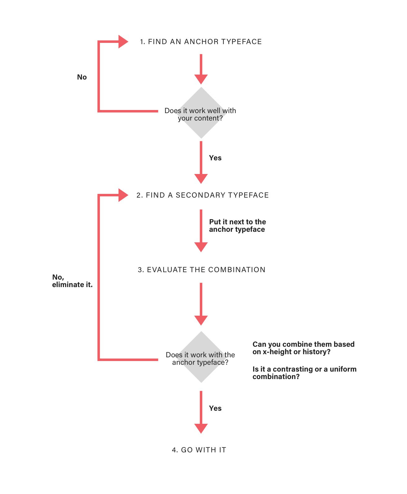

### 1 Find an anchor
At this point you should have your main typeface—the one you want to use for your body text. Just like we described in the previous chapter: you’ve read the text, you know what the website is about, you have a sample of the content, you tried previewing it in different web browsers and you decided that this is the typeface you want to go with. Now let’s find a secondary typeface that will complement it well.

### 2 Find secondary typefaces for possible combinations
This is probably the most time consuming task in the process. Maybe even the most time consuming task in typography. It’s time to explore the universe of typefaces. I know that when I start doing that, I’m completely disconnected from the world for a couple of hours. At least. But where do you start? At first you might just add a few typefaces that you like to the list of possible candidates. Maybe it’s a typeface you used before. Maybe it’s the one you’ve been saving to use for a project just because you like it that much. Give it a try, put it on the list.

There’s many web font providers out there. Google Fonts is probably the most widespread. Offering fonts for free probably helps but it comes with a setback. Most of the fonts there are rubbish. This doesn’t mean that you can’t find good ones. Searching the fonts directory is quite limited. The most helpful part is probably just excluding or including certain categories.
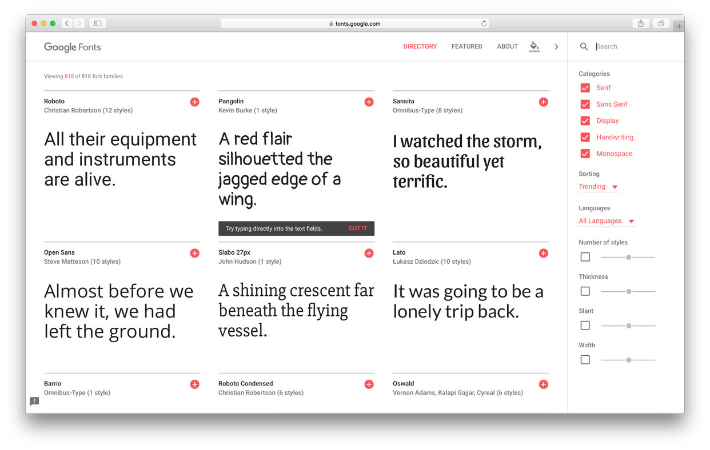
Figure 28: Google Fonts is a popular font directory but with limited filtering capabilities.

Fonts.com comes with a bit more sophisticated filters. It allows us to filter fonts by weight, width, x-height and figure styles. TypeKit comes with, in my opinion, the best options to filter fonts. Especially for people who just started to explore this vast universe. It comes with filters for width, weight, contrast, x-height, figure styles, and a recommendation for either paragraphs or headings. All of them come with the ability to filter by languages supported which should be a deciding factor in the process.

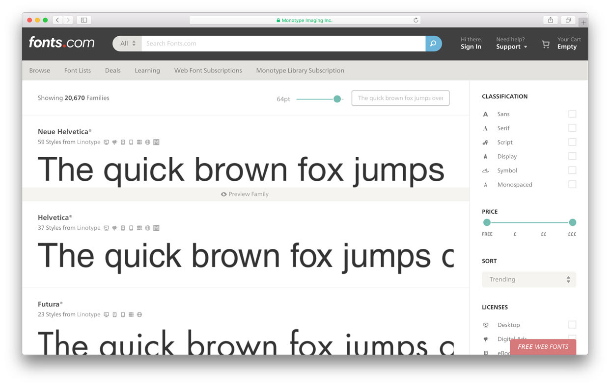
Figure 29: Fonts.com comes with a vast collection of fonts and a better way to filter them than Google.

Figure 30: TypeKit has a very good fonts filtering system. It allows to filter by classification, recommendations for either body text or headings, and other typeface properties like weight, width, x-height, contrast, figure style etc.

Filter the list to match what you’re looking for and start browsing. Whenever you see something you like, something you think fits your grand design, add it to the list of potential candidates. Try not to spend too much time on this. Don’t go too deep into exploring each typeface at this stage yet.

### 3 Evaluate the combination
I recommend doing this in the browser, possibly in the right context. Do you have an early design of the website? Use that. Do you have a slight idea of what the layout will be like? Make a quick prototype. Don’t know how to code? Pair up with your developer. Don’t know much about the design and the project? Pair up with your designer. Remember that both roles are important in web typography. If your skills are one-sided, working together is key to producing better web typography.

Contrast and uniformity are the two most basic principles when it comes to design, architecture and art. Both are crucial when it comes to typography as well. Some evaluations described in this process will only work as a contrasting combination, some only as a uniform one and some as both. Let’s take a look at a real-life example.

Take a look at this photo of a living room. How would you describe it? It feels modern, right? But there’s something else. It feels warm, too. Unusual for living rooms with modern, futuristic furniture. Yet, this one does. The brick wall brings this feeling of warmth and coziness to a room that would look cold without it. This is a great example of contrast in interior design. Through contrast, the designer was able to achieve perfect harmony between modern and warm.

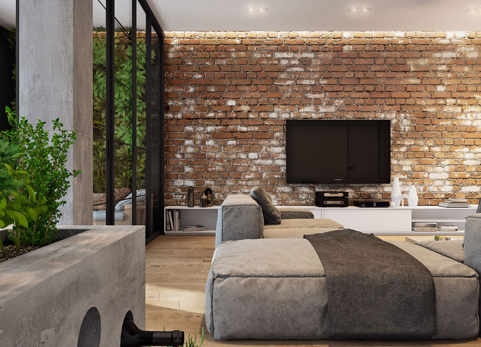
Figure 31: An old brick wall and modern furniture in the same room. Harmony through contrast (Source: home-designing.com).

How can we apply this to typography? Let’s take the Baskerville typeface for our main body text. Baskerville was designed by John Baskerville in 1754. It was a modern typeface at the time as it was pushing the boundaries of what was possible in typography. It’s perceived as a classic these days though. It evokes feeling of trust and warmth. Based on an experiment, conducted by Errol Morris, it’s the most trusted typeface around. Now let’s complement it with an uppercase-only Futura for headings. Futura was designed by Paul Renner in 1927. It’s a geometric sans-serif typeface. It felt very modern when it was designed and it still feels modern to this day. It’s the most used typeface on the web at the moment.

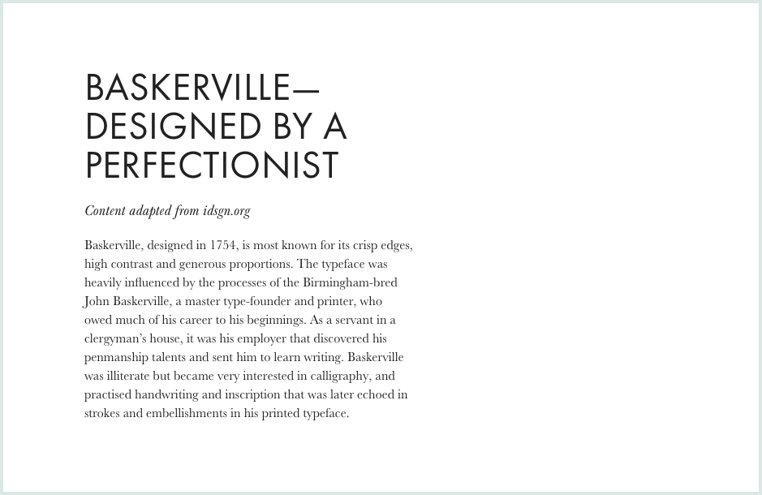
Figure 32: Harmony through contrast—Futura and Baskerville combined (content adapted from idsgn.org).

Our design looks rich. Luxurious. It has a story to tell. But most importantly—it works. It uses two typeface classics from different time periods. Each comes from the opposite of the scale between modern/cold and classic/warm. Together, they’re like fire and ice that turn into flowing water. Harmony through contrast. This brings us to the first type of evaluating typeface combinations: based on history.

### Based on history
Evaluating typefaces based on the time period works well with contrast or harmony. You could choose two typefaces that are very far apart or from the same time period. Both should work.

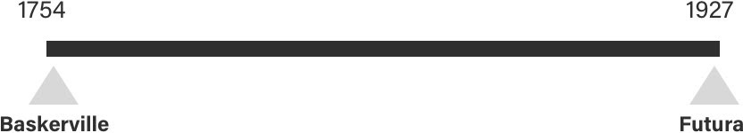
I find that this approach works best with typefaces that were designed before the digital revolution. There’s just too many typefaces being designed at the moment. Pairing them solely on the fact that they’re from the same time period might not be enough.

### Combining typefaces based on x-height
Remember when I told you to remember x-height in lesson 3 about the anatomy of typefaces? This is where it comes handy. Another way to evaluate a typeface combination is to take a close look at their x-heights, to see if they match. They should be very close at worst. Typefaces with similar x-height work better together as they have a similar visual weight. Especially when it comes to vertical rhythm (something we’ll cover in the next lesson).

Figure 34: Futura and Baskerville have a similar x-height which reinforces them as a good typeface combination.

### Some typefaces are meant to be together
There are the so called super typefaces. Typefaces that come in more than one style. A sans-serif and a serif. Merriweather is a great example. So is Roboto. You simply can’t go wrong by using the styles of one super family. This can be a great way to start developing your typeface combining skills.

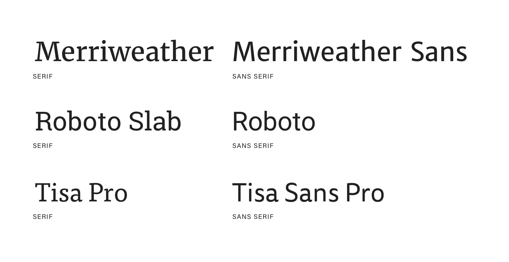

### 4 Eliminate/choose a combination
Based on the previous step, does the typeface match any of the evaluating factors? If not, you should probably eliminate the potential candidate. Repeat the steps 3 and 4 until you’re left with only one typeface. Does it match your grand design idea? Do you feel comfortable with it? Does it feel right? Not sure? Come back the next day. I’m not kidding. At this point you probably spent a few hours looking at typefaces and combinations of typefaces. It’s time to take a break. You’ll get a fresh look on your work by doing so. My personal guideline is: come back tomorrow, if it feels right, go with it, if not, change it.

All of your potential candidates got eliminated? You’ll have to start all over. I told you this takes time. There’s still an option to go with only one typeface. It’s your choice.

### Explore further
1. [Combining Typefaces — Tim Brown](https://typekit.files.wordpress.com/2016/04/combiningtypefaces.pdf)
2. [fonts.greatsimple.io — Google Fonts Combinations](http://fonts.greatsimple.io/)
3. [Beautiful Web Type](http://chad.is/beautiful-web-type/)
4. [How typography shapes our perception of truth](https://www.fastcodesign.com/3046365/errol-morris-how-typography-shapes-our-perception-of-truth)

## 6 Rhythm in Web Typography

Rhythm in typography is just like rhythm in music. A text can either flow like a masterpiece symphony performed by an in-tune orchestra or it can be a disjointed, flimsy song by a one-man band wannabe. Just like in music, where order is more pleasurable to our ears than chaos, so is a well designed text with an established rhythm easier to read and more enjoyable to consume by our eyes. Ears and eyes are just the sensory tools, it’s our mind that processes this information. And our mind is a machine for pattern recognition. That’s why a well-tuned, rhythmic and proportional text will always triumph over a scrappy one. Unlike in music, there’s two types of rhythm in typography: horizontal and vertical.

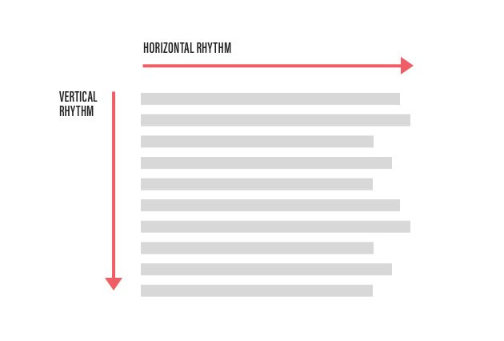
Figure 36: Vertical and horizontal rhythm in typography.

The music analogy works very well with typography because your text will either be easy to read and the reader will get into flow—not focusing on reading but simply consuming the content —or struggle through the information before finally giving up. Horizontal rhythm mostly impacts the legibility while vertical rhythm impacts the readability of the text and establishes a sense of visual hierarchy.

### Horizontal rhythm

#### Letter-spacing (tracking)
Letter-spacing is more commonly known as tracking in print design. It can have a massive impact on the legibility of the words so it should be used with caution. Letter-spacing lower case is not recommended. A man who would letterspace lower case would shag sheep, Frederic Goudy used to say. Letterspacing impacts legibility because it makes the words harder to be deciphered by our brain. Reading slows down, even for fast readers. Unless you have a very good reason for doing so, don’t letterspace the main body text.

There are two occasions when letter spacing can have a positive impact. Headings tend to be larger and heavier than the body text. Because of their larger size, the spacing between the letters also looks optically larger than at smaller sizes. In this case, it’s a good idea to slightly reduce the letterspacing. We’re talking about 3–5% not more. This will make your heading a bit more compact, and a bit closer to what type in the body looks like.

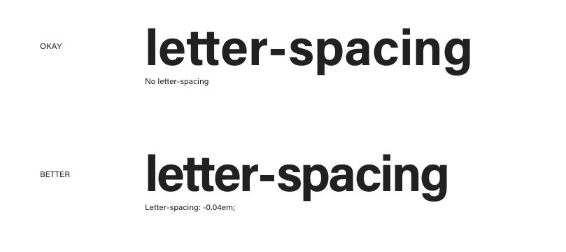
Figure 37: Applying a negative letter-spacing to headings makes them more compact and closer to what body type looks like.

Another occasion where letterspacing can be useful is when applied to small caps or uppercase text only. Using uppercase for longer text is a really bad idea, so this might be best combined with headings again. Whenever we have a line of text set in all uppercase or small caps (we’ll cover small caps in lesson 9), it’s a good idea to increase the spacing between the letters just a bit. Again, we’re talking about small increases, but just enough to make a difference. My recommendation is from 5 to 10%.
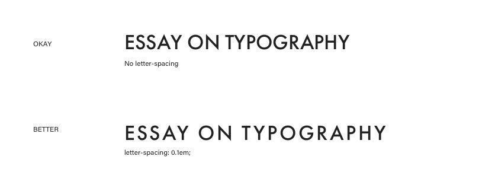
Figure 38: Applying letter-spacing to uppercase or small caps helps with legibility.

By doing so, we make the uppercase letters and words easier to read and process. Besides that, a bit more space between the letters will add a touch of sophistication to our design. Pay attention to well designed products or brands that use all uppercase in their branding. You’ll notice that most of them are letterspaced.

Letterspacing acronyms, and long series of digits is also recommended.

### Kerning
Spacing between different letters is far from equal. Each letter comes with a default set of spacing around it, no matter the neighbouring letter. That’s why we get inconsistencies like this:

Figure 39: Bad kerning, in typography also known as keming (Source: Sky Fontanet’s ePortfolio).

Kerning—altering the spaces between particular pairs of letters—can resolve these issues. The result is a much better proportioned word and optical perfection.

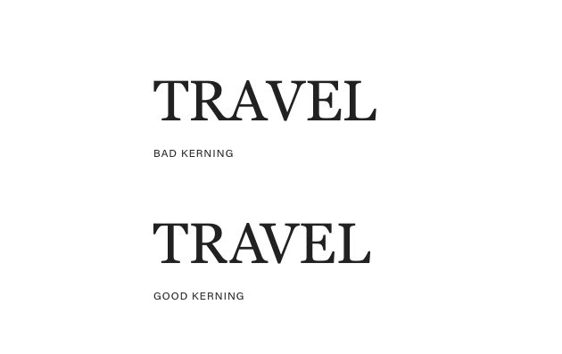
Figure 40: Fixing the bad kerning.

Most web browsers default kerning to auto. This means that the kerning will be enabled for larger type and disabled for smaller. Bad kerning is not as obvious on small type. If you wish, you can control it like this:

font-kerning: auto; // default
font-kerning: normal; // enables kerning
font-kerning: none; // disables kerning

That’s about it when it comes to what we can do with the default browser support right now. This is probably not good enough for special occasions when we need to move a particular letter by x pixels to achieve that optical perfection. Thankfully, there’s tools like [Lettering.js](http://letteringjs.com/). With it, we can control the positioning (and also style) of each letter.

### Don’t justify on the web
A break in music has a meaning. It separates the sound from silence. Nothingness from the rich sound of a chord. It seemingly breaks the rhythm (even though breaks in music always match the rhythm). We get the same effect in typography. A combination of letters, words and empty spaces define the rhythm. For a flow of reading, that rhythm needs to be consistent. And because (as we learned earlier) we read word by word, too much spacing between words breaks the rhythm. It breaks the flow of reading. It turns the easiest text to read into one that is hard to consume. No matter the language or words used. I still encounter this far too often on the web:
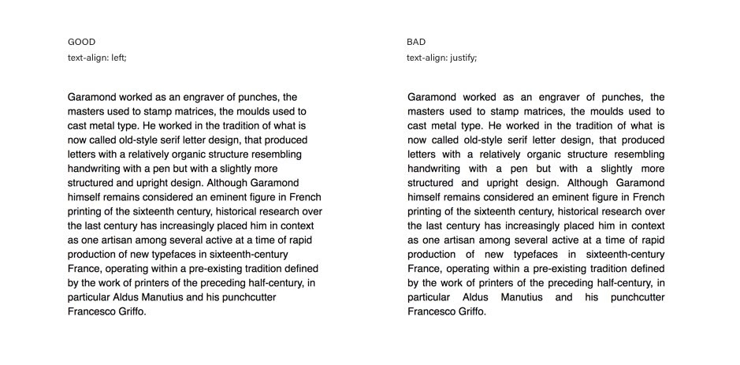
Figure 41: Comparing left-aligned and justified text on the web (No hyphenation).

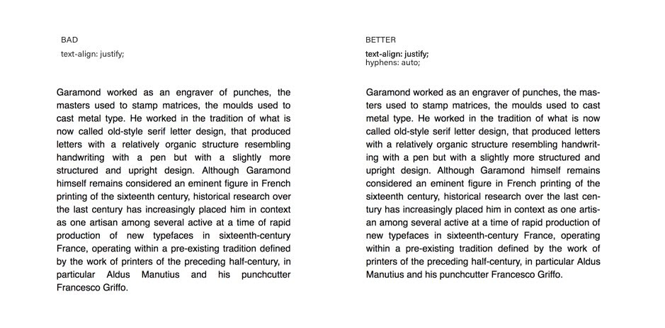
Figure 42: Comparing two justified paragraphs, one hyphenated one not.

Web browsers render justified text very poorly. They don’t have the necessary algorithms to properly set the spacing between words and even individual letters. That’s why justified texts come with patches of space between the words. The rivers of white between the black of text. This makes it very hard to read so justifying text on the web should be avoided at all costs. Web browsers are getting better in supporting hyphenation though. If you do use justified text, complement it with hyphenation.

### Vertical rhythm
Let’s say that a website has the main body text set in 20 pixels and a line-height of 30 pixels. The measure (line width) should be appropriate for this size and line-height—600 pixels looks just about right. We now have all we need to set up the vertical rhythm throughout the page. To do that, we need a basic rhythmical unit. In typography, that’s leading (line-height). We can see it, by adding a 30 pixels tall baseline grid to our website.

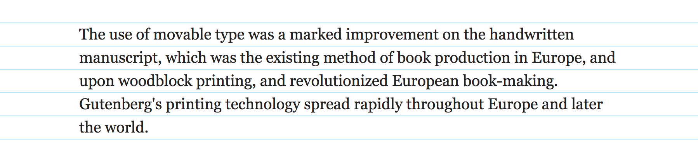
Figure 43: Baseline grid indicates equal line-height and vertical rhythm.

Note: Unlike in print and graphic design, the baseline grid lies right in the middle of the lines. Lots of people ask me if it shouldn’t lie right at the bottom of the bodies of letters. Not on the web. Take a look at how web browsers interpret a line of text:

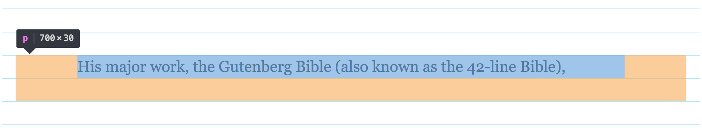
Figure 44: Baseline grid on web falls right in the middle between the lines. Unlike in print, where letter bodies lie directly on it.

We only have a paragraph of text for now, so everything looks right. To keep this rhythm going, we need to use the line-height as a base unit for every size, margin and padding on the site. Let’s see. We want to add a title to our text. We assign a size of 55 pixels to it to make it stand out. Its line-height now needs to be an even multiple of the line-height. This also applies for its margins—especially top and bottom ones.

 h3 {
  font-size: 55px;
  line-height: 60px; // = 2 * 30px (body text line-height)
  margin-top: 90px; // = 3 * 30px
  margin-bottom: 30px; // = 1 * 30px
 }

Note: I’m using pixels for these examples but you should be using units like em, rem or just a decimal 1.5 or percentage (150%) value for line-height.

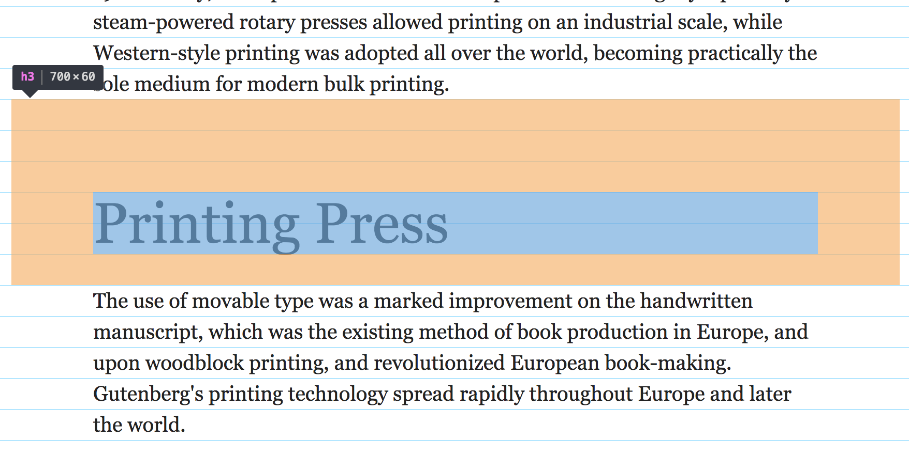
Figure 45: heading 3’s line-height equals 2 lines, its margins equal 3 lines on top and one line at the bottom. Everything falls in its place.

We assigned a line-height of 60 pixels because it’s the next multiple of our base line-height (30 pixels) that comfortably accommodates the title set at 55 pixels. A guideline that I like to stick with is that the bottom margin should be noticeably smaller than the top one. The title needs to visually connect with the text beneath it. The text it’s referring to. And that’s exactly what we want to achieve with vertical rhythm and visual hierarchy. A reader can now understand the structure of the text by simply scanning it.

Because we’ll be needing this in most cases it’s the best practice to assign default line-height, margins and paddings to all elements and deviate from it  only when necessary.

 * {
  line-height: 30px;
  margin-top: 0;
  margin-bottom: 30px; // = 1 * 30px
 }
 
So if you want your lists to have a specific bottom margin, you’d go for something like this:

 ul, ol {
  margin-bottom: 60px; // = 2 * 30px
 }
 
What happens when an image breaks the vertical rhythm might be the question that’s on your mind at the moment. You’re right. Images come in various sizes. It’s impossible to expect that we’ll be able to control their height in every occasion. Especially for large scale websites. What do we do then? My suggestions: let it be. Use the baseline grid as a guide, not as a restraint. Your text and your page still has vertical rhythm. It still has an established visual hierarchy. Large solid blocks of content, which images certainly are, don’t visually break it up. It may break your grid yes, but at the end of the day, it doesn’t matter.

> Clarity of meaning and ease of reading always trump the formal restraints of working with grids.
—John Kane

### Explore further
1. [Why is Vertical Rhythm an Important Typography Practice?](https://zellwk.com/blog/why-vertical-rhythms/)
2. [Kern Type, the kerning game](http://type.method.ac/)
3. [Proper hanging punctuation in CSS by Kenneth Ormandy](https://github.com/kennethormandy/hanging-punctuation)
4. [Gutenberg—A Meaningful Web Typography Starter Kit](http://matejlatin.github.io/Gutenberg/)
5. [Grid Lover](https://www.gridlover.net/try)

## 7 Modular scale & meaningful typography

How do you assign sizes to type when you work on a website? Do you just randomly pick numbers depending on what you think looks good? Do you usually end up with way too many different sizes and no idea where they came from? Does your website type start to look chaotic after a while? How about your CSS? Can you manage the upkeep without going crazy?

I remember how I used to set type sizes before I met the idea of modular scales. It was very similar to what I described above. No real reason for a particular size. No real meaning. It was all just numbers. Random numbers mostly. Main body type..? 16px should be fine. Heading one..? Yeah let’s go for 40px. Figure caption..? 15px? Why not. This was my process back then.

A modular scale brings order, harmony and meaning to your type sizes, code, typography in general and in the end, what matters the most, your website.

The next time you need to choose a size for a particular text on the website you don’t choose from the infinite sizes incremented by 1 pixel, you choose from a finite range of predefined and calculated sizes. This will help you keep your code modular and therefore clean and easier to understand. As this works well for you, it works equally well for the reader. Instead of figuring out what numerous different text sizes represent, they only have to figure out a few. Because they repeat more often it’s easier to decipher their role and the relationship between them. The visual hierarchy and order are properly established.

Most graphic design tools come with a default typographic scale. So do some front end development frameworks.

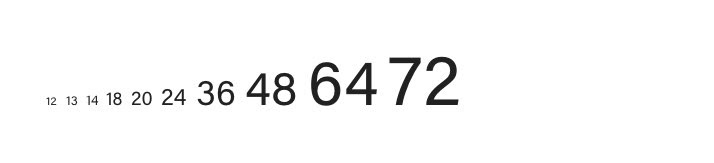
Figure 46: Diatonic scale.

This is the so called diatonic scale. You probably stumbled upon it before. I’m sure designers that work in either Photoshop or Sketch have. In the worst case you follow the sizes in this scale. “Worst scale” here sounds worse than it should, as there’s nothing wrong with using this scale. It’s a scale like any other. But sometimes you may want to experiment with different ones. Throw the boring out of the window and bring in something new. Something fresh.

Tim Brown from Adobe came up with the idea of Modular scale, built a tool to create your own scales and presented it to the web design community. The idea of a modular scale is simple: create your own scale by setting some base values like text size and line width.

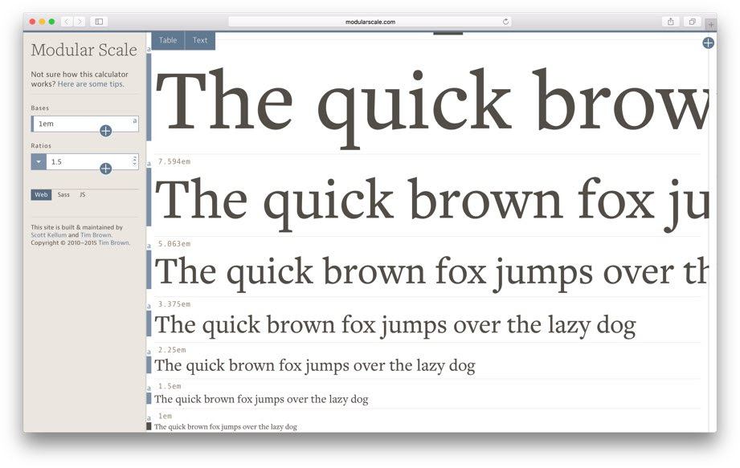
Figure 47: Modular Scale by Tim Brown.

### Using a modular scale

##### 1 Choose your base size
Once you decided what typeface to use for your main body you need to find out what size works best. As we’ve seen before, not all typefaces sizes are equal. Some seem taller or bigger, some shorter and lighter. Put it in your browser and experiment with the size, line-height and measure. Once you decided what size works best, use it as your base size for the modular scale.

#### 2 Choose a scale
There’s quite a few to choose from. Explore and compare them a bit. The golden section is probably the most popular. It’s been popular in graphic design and architecture for ages. It’s based on the Fibonacci numbers which produce a pattern that is supposedly present everywhere in the nature and the universe. The one that I found works best for me is the Perfect Fifth with a ratio of 2:3. I find it to be more flexible than the rest. The goal here is to find out what works best for you and come up with your own unique style.

### 3 Define all your sizes so they match the scale
Once you decided which scale you’ll use, you must define all your text sizes by choosing one from the scale.

**Example:**
Let’s say we decided to set our main body text at 18px and we chose the Perfect Fifth scale. We now want to set the basic text sizes that we’ll use: headings 1 to 4, figure caption and the small print. These are the values that the scale offers to choose from:
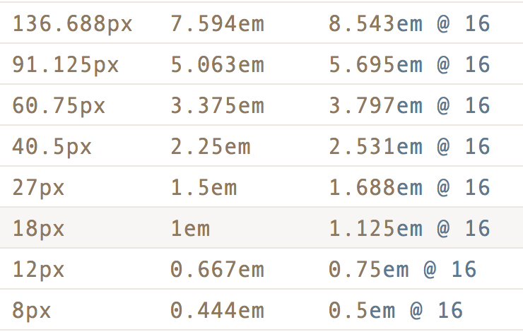
As we only need headings 1, 2, 3 and 4 we need four sizes larger than our base. We also need two sizes smaller than the base for the figure caption and small print text. So we may assign the sizes like so:
Elements	          Size
Heading 1	         3.797em
Heading 2	         2.531em
Heading 3	         1.668em
Heading 4	         1em
Figure caption	    0.75em
Small	             0.5em

### Don’t forget about the vertical rhythm
Our text sizes still need to fit into our baseline grid which defines our vertical rhythm, like we covered in the previous chapter. In this case, the heading 1 is set at 60px so it will need a line-height of 4 * line-height, which is 72px. Actually, 72 pixels might be too much, se let’s use 3.5 * line-height which results in 63 pixels. Much closer to that 1.1 to 1.3 range recommended for headings line-height. And don’t worry about that 3.5 multiple. You website will still have the correct vertical rhythm. If you do use multiples with .5, you’ll need to use a double grid, like my starter kit Gutenberg does. As I said earlier in the book, there’s no particular rules in typography. It’s up to you to shape your own or as Robert Bringhurst put it best:

> By all means break the rules, and break them beautifully, deliberately and well.

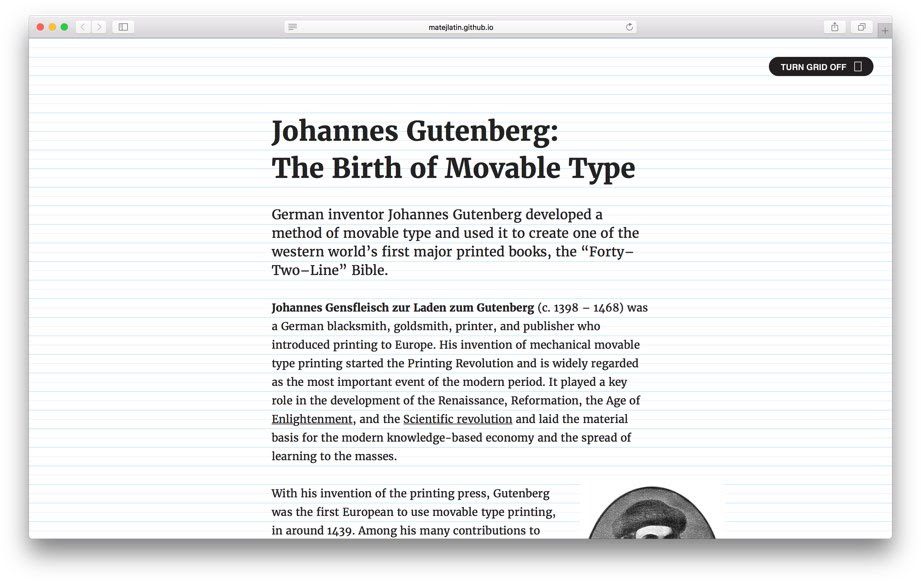
Figure 48: Gutenberg, the meaningful web typography starter kit, uses a double baseline grid to make it more flexible when it comes to font sizes and margins.

### A word on preprocessors
I’m sure the developers going through these can already see how this fits perfectly with the typical development mentality. It’s modular, hence the name Modular Scale, and scalable. And what’s best, this works great with the CSS preprocessors. Let’s take a look at how we’d set it up in Sass in three easy steps.

 // 1. Base size and ratio
 $base: 1.125em; //= 18px
 $ratio: 1.5; // Perfect Fifth

 // 2. The formula for modular scale is (ratio^value)*base so we need a power function
 @function pow($number, $exponent) {
   $value: 1;
   @if $exponent > 0 {
     @for $i from 1 through $exponent {
        $value: $value * $number;
      }
   }
   @return $value;
 }

 // 3. Let's make it simpler to use by combining everything under one roof
 @function ms($value, $ms-ratio: $ratio, $ms-base: $base){
   $size: pow($ms-ratio, $value)*$ms-base;
   @return $size;
 }

 h1 {
   font-size: ms(3); // = 60.75px
 }

All we need to use modular scale in a preprocessor like Sass is a couple of variables and functions. Each modular scales breaks down into a single number. 1.5 for the Perfect Fifth, for example. So we save that to the variable $ratio. The other variable we need is the base font size. This needs to match the size of your body font. It’s 18px in this example so I set it to 1.125em.

(ratio^value)*base

This is the formula to calculate any value in a given modular scale. That’s why we need the power formula.

In the third and final part we just write that main formula in code and it’s ready to use. We preset the two out of three parameters in that formula, so all it needs is the value parameter. ms(3) means that we want the third size on the scale.

### Explore further
1. [More Meaningful Typography](https://alistapart.com/article/more-meaningful-typography)
2. [Modular Scale](http://www.modularscale.com/)
3. [Modular Scale SASS](https://github.com/modularscale/modularscale-sass)
4. [Sketch plugin typographic scale](https://github.com/automat/sketch-plugin-typographic-scale)

## 8 Ligatures
In this lesson we start diving deeper into typography. We start exploring the world of micro typography. We’ll look at some aspects that impact the legibility the most. Studying typography on the micro level will help you produce top-notch typographic styles. It will help you understand what difference small details can make. It separates typographic masters from the newbies.

Ligatures. Now that’s a fancy word. You may have never heard of it before. Or you might have heard a designer mention it and shrugged it off as it’s probably something that doesn’t concern you (for the web developers in the course). Well, you may have never heard of it or payed attention to it but I guarantee you that you’ve seen it before. And once you know what ligatures are, you’ll never be able to unsee them. You’ll probably start noticing them everywhere. Let’s take a look at the definition of a ligature.

> In writing and typography, a ligature occurs where two or more graphemes or letters are joined as a single glyph.
- Wikipedia

The most common ligature, that everyone has seen is the ampersand. Yes, the “&” symbol. It comes in various shapes but in it’s core, it’s a combination of letters “e” and “t”—”et” in Latin meaning “and”. How cool is that?

Figure 49: The evolution of the ampersand ligature (Source: Wikipedia).

An interesting fact for the German speaking readers, the “sharp s” or “ß” is also a ligature (a combination of ſ and s) but just like the ampersand it’s become a character of its own.

### Origin of ligatures
Before Gutenberg made his movable type printing machine, all books were handwritten. Every book was a unique copy, usually transcribed by monks. Can you imagine transcribing a book like the Bible? It took a long time. So the scribes that were transcribing these came up with clever ways to speed the process up. Even if just by little. They started combining some letters into single shapes.

When the printing machine was first invented, it closely imitated the medium that came before it—handwritten books. With that, it imitated the ligatures as well. But in print, besides saving time, there was another reason for combining letters into single glyphs—aesthetics. Take a look at the following sets of characters.

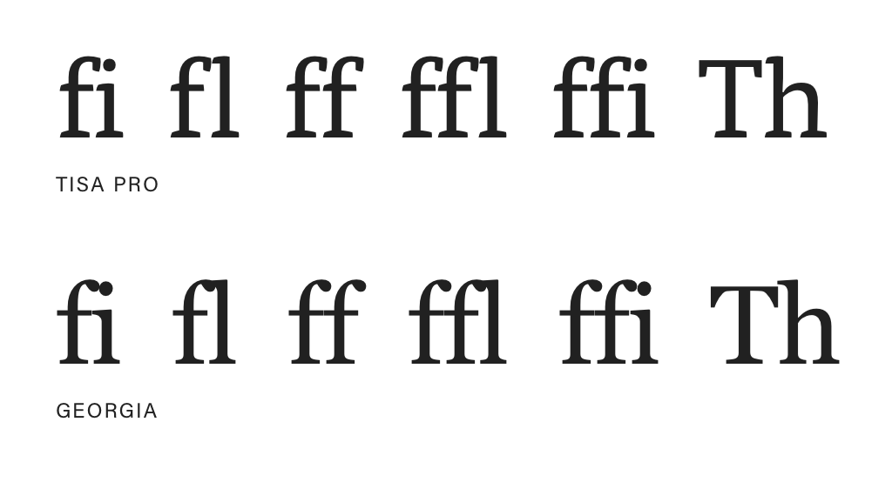
Figure 50: There’s nothing obviously wrong with these sets of letters.

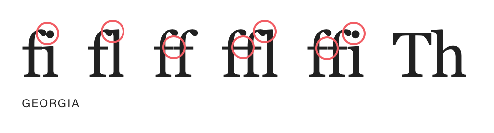
Figure 51: All the unappealing features of these letter sets in Georgia.

Take a close look. Notice that some letters collide with others (especially those set in Georgia). The combination of “f” and “i” is particularly noticeable. Particularly unappealing as well. This is where typography really grabs you by the legs, starts pulling and never lets you go. Once you start noticing these little details, there’s no way back. So what is the solution for this unappealing set of letters? A ligature. Or ligatures, because there’s quite a few of them still in use today.

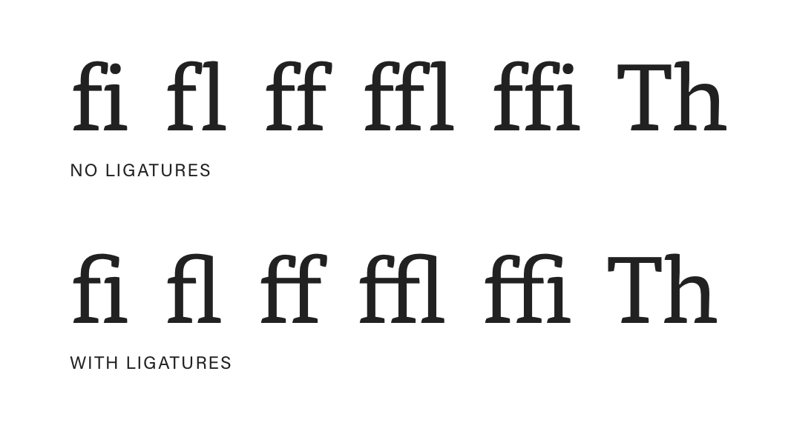
Figure 52: Same sets of letters, with and without ligatures. Can you spot all the differences?

### What's the point of ligatures?
So ligatures were designed to save time, improve the aesthetic aspect of a text or typeface and to improve the legibility. With transcribing books and hand-setting type for printing being done and dusted, we’re only left with the aesthetic aspect and legibility. Remember how we said that horizontal rhythm affects legibility? Ligatures can play a noticeable part in improving legibility. Take a look at the figure 53. We have two sentences. They’re the same with a purpose. The first sentence doesn’t have the ligatures enabled while the second one does. Notice the lines that indicate the starts and the ends of the sentences. Notice the difference in the width. The ligatures cause that difference. That’s why they have an impact on vertical rhythm, and that’s why they have an impact on legibility.
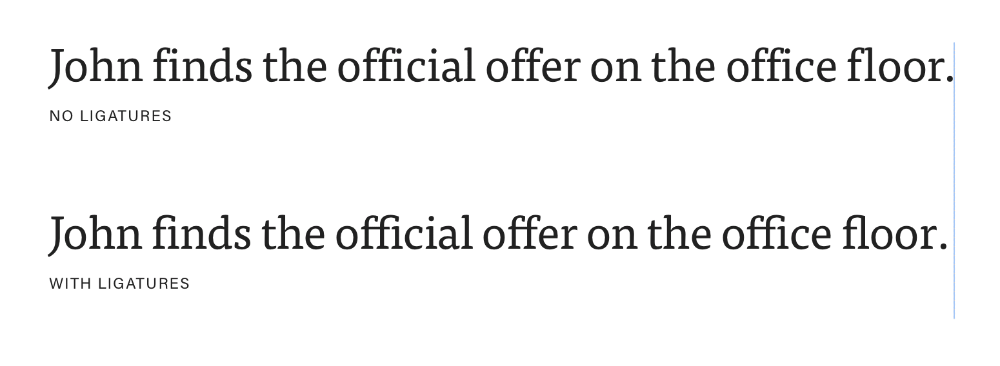
Figure 53: Ligatures help keep the horizontal rhythm consistent.

### Types of ligatures
There’s many types of ligatures but when it comes to web typography, the two major groups are common ligatures and discretionary ligatures.

### Common ligatures
These are the ligatures that substitute letter combinations like “ff”, “fi”, “fl”, “ffi”, “ffl”, “th”. These are enabled by default by most web browsers. If you want to disable them for some particular reason, you can do so with using this:
 

 .class {
   font-variant-ligatures: common-ligatures;
   -moz-font-feature-settings: "liga", "clig";
   -webkit-font-feature-settings: "liga", "clig";
   font-feature-settings: "liga", "clig";
 }

### Discretionary ligatures
These are the non-standard ligatures and usually don’t really contribute to legibility at all. They’re much more stylistic then their common counterparts. Examples are letter combinations of “ch”, “ck”, “ct” and “st” (figure 54). It’s usually best to avoid using them but for those rare cases that you do, you can do so like this:

 
 .class {
   font-variant-ligatures: discretionary-ligatures;
   -moz-font-feature-settings: "dlig";
   -webkit-font-feature-settings: "dlig";
   font-feature-settings: "dlig";
 }
 
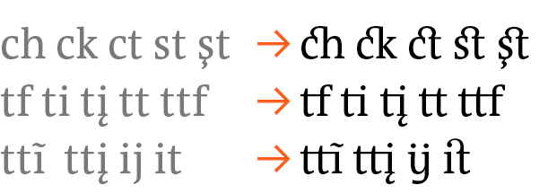
 
### Contextual ligatures
Contextual ligatures usually come with the script typefaces. In most cases they combine the letters so it looks like they were written in one stroke. If you do use a script typeface it’s recommended that you enable these ligatures if available. The text set in this typeface will look more genuine (see comparison in figure 55). Controlling contextual ligatures is as easy as (if the typeface you’re using supports them):

Figure 55: Contextual figures (Source: Adobe)

#### Other notes on using ligatures on the web

If you’re looking for the quickest and most basic way to enable or disable ligatures look no further than text-rendering property. It will enable the common ligatures and kerning (Chrome and Firefox do this by default).

 text-rendering: optimizeLegibility; //enables common ligatures and kerning
 
Note that if you set letter-spacing to your text it will not feature any ligatures. The browsers will strip them away.

### Explore further
1. [Typographic ligature](https://www.wikiwand.com/en/Typographic_ligature)
2. [Tomorrow’s web type today: The fine flourish of a ligature](http://www.elliotjaystocks.com/blog/the-fine-flourish-of-the-ligature/)
